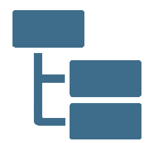
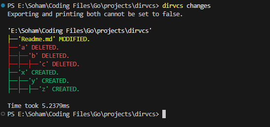
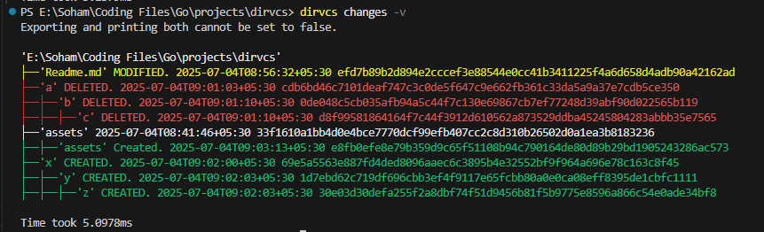
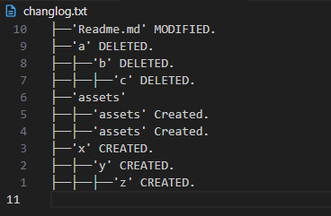
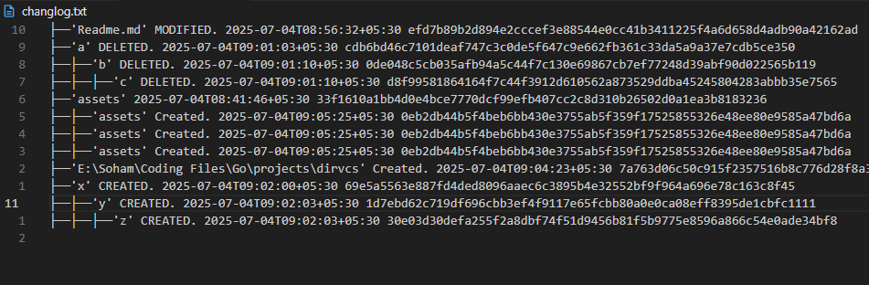
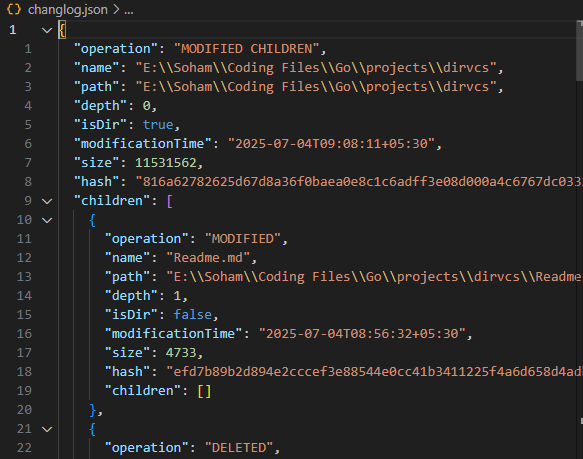
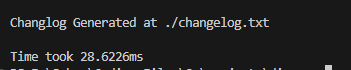

# DirVCS 

<p >
  
</p>

**DirVCS** is a lightweight version control system for directory structures, inspired by Git but optimized for snapshots of file trees.

Designed to be fast and efficient for tracking large directory structures and used for backups tracking.

> Benchmarked: 13.6 GB • 231,946 files • 25,984 folders  
> Indexing Time: ~15.14 seconds

This was achieved due to only tracking of file changes , not the file content changes like git.

---

## Features

- Snapshot (persist) current directory state
- Compare any two snapshots or with the current working directory
- List, view, and remove old snapshots
- Export directory trees to JSON format
- Ignore specific files and folders using a .ignore file
- View internal logs of operations
- YAML-based configuration system
- Optimized performance for large-scale directory trees

---

## Installation

Requires **Go 1.20+**
```bash
    git clone https://github.com/SohamJoshi25/dirvcs
    cd dirvcs
    go build -o dirvcs
    ./dirvcs --help
```
---

## Command Reference

### init

Initialize a new DirVCS repository.
```bash
    dirvcs init
```
---

### persist

Create a snapshot of the current directory state.
```bash
    dirvcs persist -m "Initial snapshot"
```
---

### tree

List, view, or remove persisted snapshots.
```bash
    dirvcs tree   #Similar to 'tree' command in unix.
    dirvcs tree --list
    dirvcs tree --index 1
    dirvcs tree --uuid <UUID>
    dirvcs tree --remove <UUID>
```
Outputs

- tree --list
```bash
    === 0 ===
    TreePath : E:Go\projects\dirvcs\.dirvcs\trees\17822654-176b-4ba5-b77a-01aae8039395.gz
    TreeHash : 151c2a4775a82026830a2b3136343c0cf495195196639b923c102564ed685459
    TimeStamp : 2025-07-04T08:51:48+05:30
    Persist Message : d
    Tree UUID : 17822654-176b-4ba5-b77a-01aae8039395
```


- tree --index 1 

```bash
    TreePath : E:Go\projects\dirvcs\.dirvcs\trees\1cbb604d-c4cb-42fe-b52e-5496a40f8c57.gz
    TreeHash : 46442bccff2fc0e7659c36888d544e57e77444191ca00f6bfacb3b8f4b53d928
    TimeStamp : 2025-07-04T09:01:45+05:30
    Persist Message : 2
    Tree UUID : 1cbb604d-c4cb-42fe-b52e-5496a40f8c57

    'E:Go\projects\dirvcs'
    ├──'LICENSE'
    ├──'Readme.md'
    ├──'a'
    ├──├──'b'
    ├──├──├──'c'
    ├──'assets'
    ├──'cmd'
    ├──├──'changes.go'
    ├──├──'config.go'
    ├──├──'export.go'
    ├──├──'ignore.go'
    .
    .
    .
```

Tree 
---

### changes

Compare differences between two snapshots, or between a snapshot and the current state.
```bash
    dirvcs changes
    dirvcs changes --old -o <UUID>
    dirvcs changes --old -o <UUID> --new -n <UUID>
    dirvcs changes --old-path <file1.gz> --new-path <file2.gz>
    dirvcs changes --export-simple <changelog.txt>
    dirvcs changes --export-verbose <changelog.json>
    dirvcs changes --print -p
    dirvcs changes --export -e
    dirvcs changes --verbose -v
```
Notes:
- At least one snapshot must exist before running `changes`.
- --export-verbose and -e when used together does nothing.
- If both export and print are disabled, output defaults to terminal.

Outputs:

- printing to terminal
```dirvcs changes```



<br>

> verbose printing to terminal 
```dirvcs changes -v```



<br>

> Exporting changlogs in text 
```dirvcs changes --export-simple ./changlog.txt```

 

<br>

> Exporting changlogs in verbose text 
```dirvcs changes --export-simple ./changlog.txt -v```



<br>

> Exporting changlogs in json
```dirvcs changes --export-simple ./changlog.txt -v```



<br>

> Default Exporting changlogs (json/txt depends on config.verbose)
```dirvcs changes --export-simple ./changlog.txt -v```

 

<br>

> Default Exporting changlogs using absolute path
```bash
dirvcs changes --old-path 'E:\Soham\Coding Files\Go\projects\dirvcs\.dirvcs\trees\17822654-176b-4ba5-b77a-01aae8039395.gz' --new-path 'E:\Soham\Coding Files\Go\projects\dirvcs\.dirvcs\trees\1cbb604d-c4cb-42fe-b52e-5496a40f8c57.gz' -p
'E:\Soham\Coding Files\Go\projects\dirvcs'
├──'Readme.md' MODIFIED.
├──'a' CREATED.
├──├──'b' CREATED.
├──├──├──'c' CREATED.
├──'E:\Soham\Coding Files\Go\projects\dirvcs' Created.

Time took 24.5586ms
```
---

### ignore

Manage ignored files and directories.
```bash
    dirvcs ignore node_modules dist
    dirvcs ignore --list
    dirvcs ignore --remove node_modules
```
---

### logs

Display internal DirVCS operation logs.
```bash
    dirvcs logs
```
---

### export

Export a snapshot or current directory tree as JSON.
```bash
    dirvcs export --path -p ./tree.json
    dirvcs export --uuid -u <UUID> --path -p ./changlog.json
```
Exported 'changlog.json'
```json
{
    "name": "cmd",
    "path": "E:Go\\projects\\dirvcs\\cmd",
    "depth": 1,
    "isDir": true,
    "modificationTime": "2025-07-03T09:22:47+05:30",
    "size": 16023,
    "hash": "d77d2ed33439c6c8b748e5c2c82e7abb1b545d88eece3073384db19d0380fccb",
    "children": [
    {
        "name": "changes.go",
        "path": "E:Go\\projects\\dirvcs\\cmd\\changes.go",
        "depth": 2,
        "isDir": false,
        "modificationTime": "2025-07-04T08:39:17+05:30",
        "size": 4771,
        "hash": "6c99122e965cb441a02741016b4164a9624182313d6558855165b06c56781005",
        "children": null
    },
    .
    .
    .
```
---

### config

View or modify configuration settings.
```bash
    dirvcs config
    dirvcs config --set-key treelimit --set-value 50
```
---

## Configuration

Configuration is stored in a YAML file at:
```bash
    .dirvcs/config.yaml
```
Example:
```bash
    changes:
      export: false
      print: true
    indent: "├──"
    treelimit: 20
    verbose: false
```
---

## File Structure
```bash
    .dirvcs/
    ├── trees/
    │   ├── <uuid>.gz
    │   └── treelogs.json
    ├── logs.json
    ├── config.yaml
    └── .ignore
```
---

## License

[](https://polyformproject.org/licenses/noncommercial/1.0.0)

DirVCS is licensed under the PolyForm Noncommercial License 1.0.0.  
See the [LICENSE](LICENSE) file for more details.

---

Built using Cobra (github.com/spf13/cobra) and Viper (github.com/spf13/viper).
`
